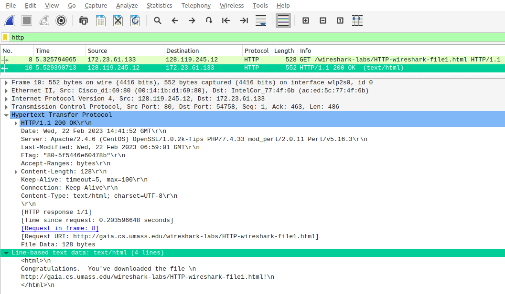
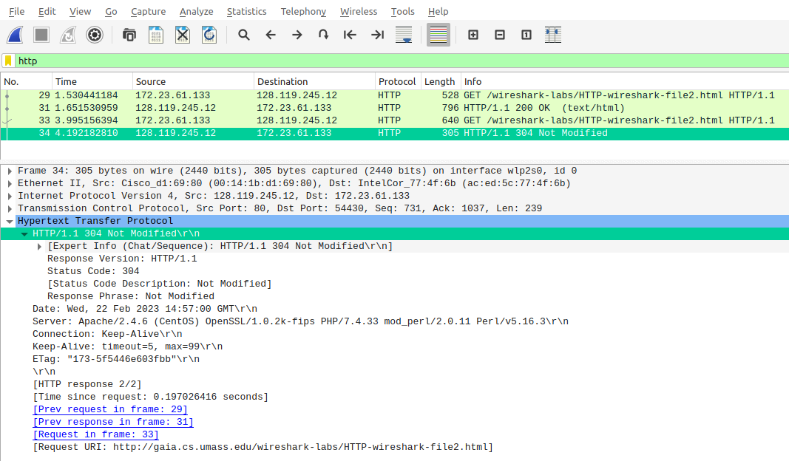
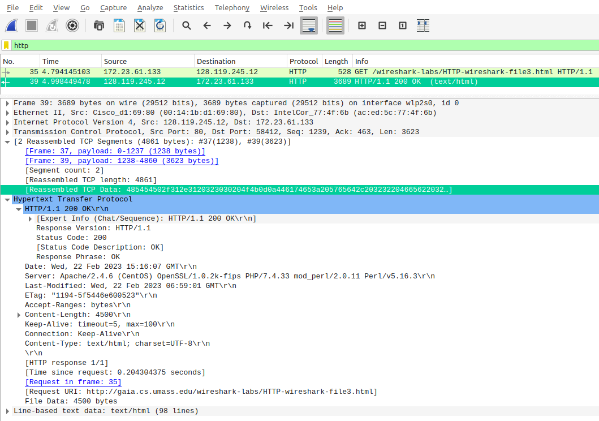
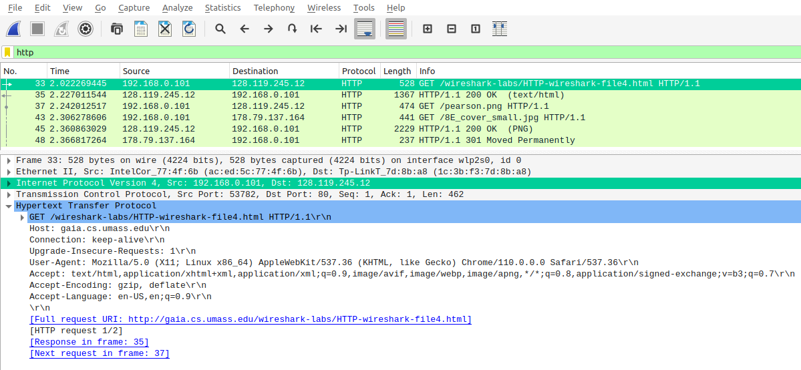
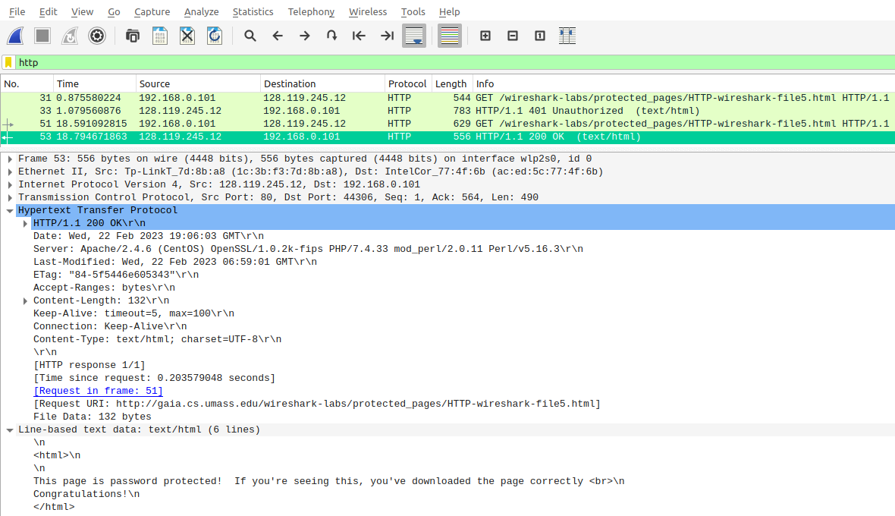

# Лабораторная работа #1
*Степан Остапенко, гр 20.Б09-мкн*

## Задание 1



### 1

И там, и там версия 1.1.

### 2

В запросе есть строка `Accept-Language: en-US,en;q=0.9\r\n`, т. е. американский английский.

Дополнительно в запросе есть user-agent: `User-Agent: Mozilla/5.0 (X11; Linux x86_64) AppleWebKit/537.36 (KHTML, like Gecko) Chrome/110.0.0.0 Safari/537.36\r\n`.

### 3

В запросе есть строчка `Internet Protocol Version 4, Src: 172.23.61.133, Dst: 128.119.245.12`. Здесь `Src` показывает мой адрес, а `Dst` показывает адрес ресурса.

### 4

Возвращается `200 OK`.

### 5

В ответе есть строчка `Last-Modified: Wed, 22 Feb 2023 06:59:01 GMT\r\n`.

### 6

В ответе есть строчка `Content-Length: 128\r\n`, т. е. возвращается 128 байт.

## Задание 2



### 1

Нет, не вижу.

### 2

Да, вернул. В ответе есть секция, которая содержит веб-страницу в явном виде:
```html
Line-based text data: text/html (10 lines)
\n
<html>\n
\n
Congratulations again!  Now you've downloaded the file lab2-2.html. <br>\n
This file's last modification date will not change.  <p>\n
Thus  if you download this multiple times on your browser, a complete copy <br>\n
will only be sent once by the server due to the inclusion of the IN-MODIFIED-SINCE<br>\n
field in your browser's HTTP GET request to the server.\n
\n
</html>\n
```

### 3

Во втором запросе есть строчка `If-Modified-Since: Wed, 22 Feb 2023 06:59:01 GMT\r\n`. В ней содержится информация о времени, изменения после которого не содержатся на компьютере.

### 4

Возвращается `304 Not Modified`. Содержимого файла нет, т. к. он не изменился после времени, указанного в запросе.

## Задание 3



### 1

Одно сообщение. Номер пакета -- 35.

### 2

Ответ содержится в пакете 39.

### 3

Два сегмента: `[2 Reassembled TCP Segments (4861 bytes): #37(1238), #39(3623)]`.

### 4

Информации нет. Это логично, потому что протокол HTTP находится выше, чем протокол TCP.

## Задание 4



### 1

Было отправлено три запроса по адресам:
1. http://gaia.cs.umass.edu/wireshark-labs/HTTP-wireshark-file4.html
1. http://gaia.cs.umass.edu/pearson.png
1. http://kurose.cslash.net/8E_cover_small.jpg

### 2

Насколько я понимаю, фотографии были загружены параллельно, поскольку пакеты-запросы на загрузку фотографий находятся под номерами 37 и 43, а пакеты-ответы с фотографиями находятся под номерами 45 и 48. Также по времени видно, что оба ответа пришли позже, чем запросы.

## Задание 5



### 1

Ответ `401 Unauthorized`.

### 2

Добавилось поле `Authorization` с токеном авторизации, у которого есть поле `Credentials: wireshark-students:network`.
