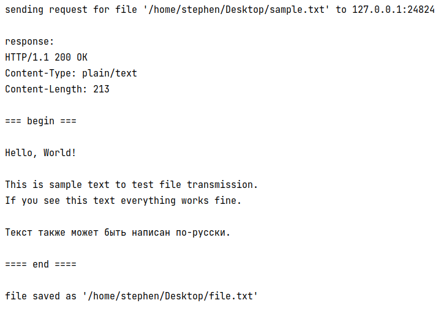
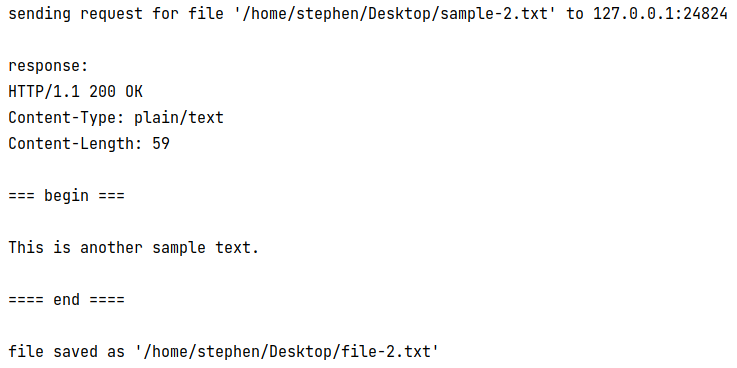
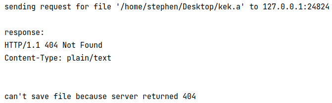

# Лабораторная работа #3
*Степан Остапенко, гр 20.Б09-мкн*

## Задание 1

Клиент и многопоточный сервер с контролем максимального количества
потоков написаны на kotlin.

Код:
* [сервер](server/src/main/kotlin/Main.kt)
* [клиент](client/src/main/kotlin/Main.kt)

Запуск производится с помощью gradle:

* сервер:
```shell
./gradlew run --args="-c <concurrency level> [-p <port>]"
```
из корня модуля `server`.

* клиент:
```shell
./gradlew run --args="-a <host address> -p <port> -f <file name> [-s <path to save received file>]"
```
из корня модуля `client`.

Если порт для сервера не указан явно, выбирается случайный свободный.

Если при пользовании клиентом хочется не только посмотреть файл, но и сохранить его, можно воспользоваться флагом `-s`.

### Примеры работы

#### Запрос файла



#### Еще запрос файла



#### Запрос несуществующего файла



#### Запрос на выключенный сервер


## Задание 2

### Задача 2

Из условия `d = 1 / 100 + 0.01 = 0.02`, а `N = 11`. Тогда `a = N / d = 11 / 0.02 = 550`.
