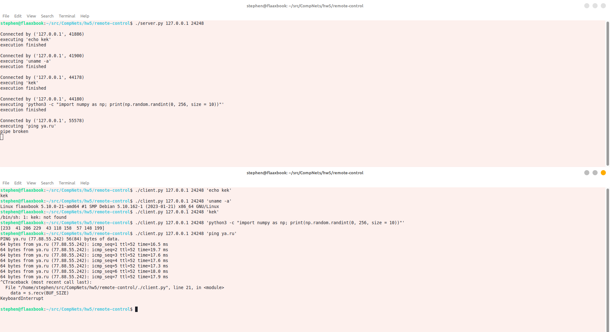
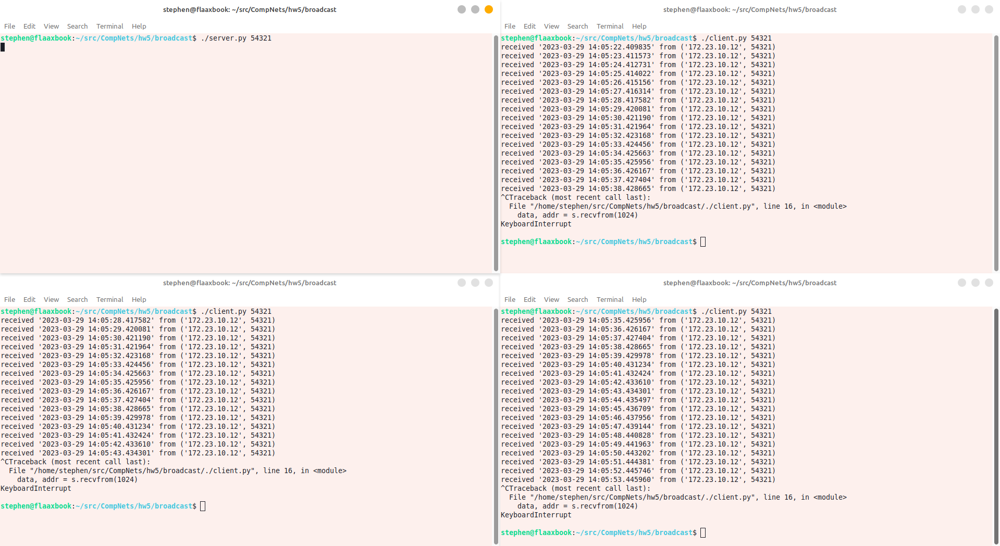

# Лабораторная работа #5
*Степан Остапенко, гр 20.Б09-мкн*

## Задание 1

### 1. Почта и SMTP

Почтовый клиент, реализованный на kotlin, находится в папке [`mail`](./mail).

Запуск:
```shell
./gradlew run --args="[-n <name>] -h <host> [-P <port>] -u <username> -p <password> [-r <recipient name>] -t <recipient address> [-s <subject>] -f <file with letter content> [-H]"
```

Описание всех параметров:
```text
Options:
  -n, --name TEXT       Your name
  -h, --host TEXT       Host address
  -P, --port INT        Port
  -u, --username TEXT   Your username
  -p, --password TEXT   Your password
  -r, --recipient TEXT  Recipient name
  -t, --to TEXT         Recipient address
  -s, --subject TEXT    Mail subject
  -f, --file TEXT       Letter file path
  -H, --HTML            Send letter with HTML body
  --help                Show this message and exit
```

### 2. Удаленный запуск команд

Клиент и сервер для удаленного запуска команд, реализованные на python, находятся в папке [`remote-control`](./remote-control).

#### Сервер

Запуск:
```shell
./server.py <host> <port>
```

#### Клиент

Запуск:
```shell
./client.py <host> <port> <command with args>
```

#### Пример работы



### 3. Широковещательная рассылка через UDP

Клиент и сервер для широковещательной рассылки, реализованные на python, находятся в папке [`broadcast`](./broadcast).

#### Сервер

Запуск:
```shell
./server.py <port>
```

#### Клиент

Запуск:
```shell
./client.py <port>
```

#### Пример работы



## Задание 2

Решения задач находятся в [файле](./assets/theory.pdf).
