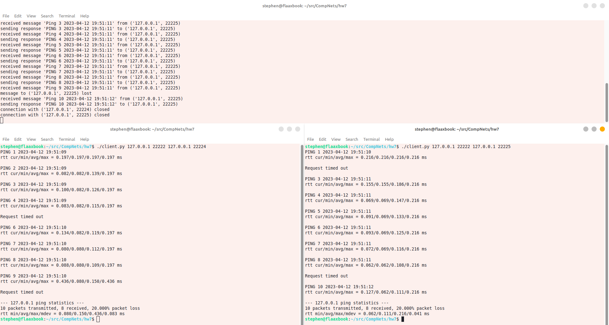
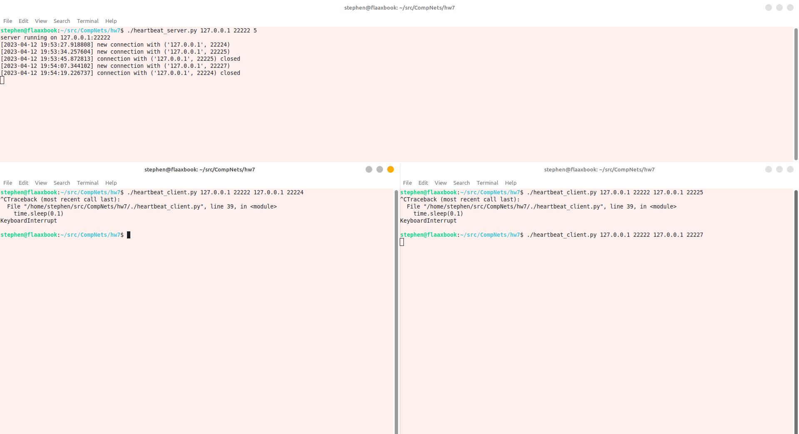

# Лабораторная работа #7
*Степан Остапенко, гр 20.Б09-мкн*

## 2. Программирование. Эхо запросы через UDP

Сервер и клиент для заданий А, Б, В находятся в файлах [`server.py`](./server.py) и [`client.py`](./client.py).

Запуск:
```
./server.py <host> <port> <timeout for connection>
```
```
./client.py <server host> <server port> <local host> <local port>
```


Сверху на картинке сервер, а снизу &ndash; клиенты.

Сервер и клиент для задания Д находятся в файлах [`heartbeat_server.py`](./heartbeat_server.py) и [`heartbeat_client.py`](./heartbeat_client.py).

Запуск:
```
./heartbeat_server.py <host> <port> <timeout for connection>
```
```
./heartbeat_client.py <server host> <server port> <local host> <local port>
```


Сверху на картинке сервер, а снизу &ndash; клиенты.
