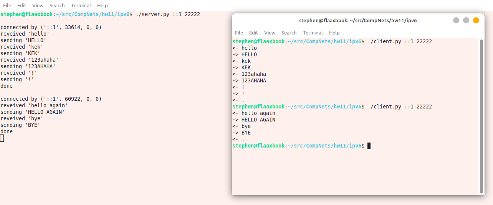
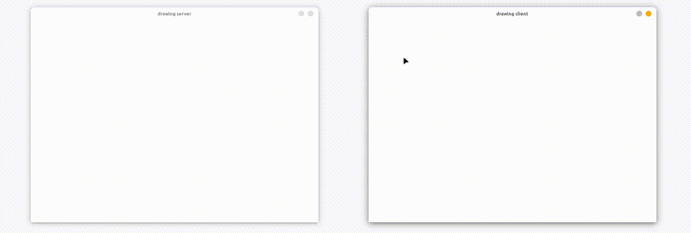

# Лабораторная работа #11
*Степан Остапенко, гр 20.Б09-мкн*

## 3. Использование протокола IPv6

Сервер и клиент для задания находятся в папке [`ipv6`](./ipv6).

Запуск:
```shell
./server.py <port>
```
```shell
./client.py <host> <port>
```

### Пример работы



## 4. Удаленное рисование

Рисовалка написана на kotlin с использованием Compose Desktop ([клиент](./remote-drawing/client), [сервер](./remote-drawing/server)).

**Важно! Запускать нужно сначала сервер, а затем клиент. Именно в таком порядке.**

Запуск сервера:
```shell
./gradlew run --args="<port>"
```
из папки `server`.

Запуск клиента:
```shell
./gradlew run --args="<host> <port>"
```
из папки `client`.

### Гифка с примером работы


