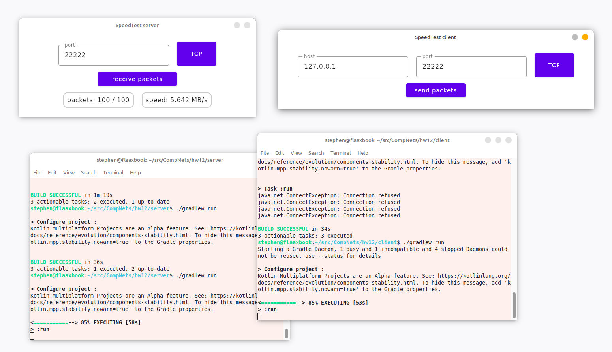
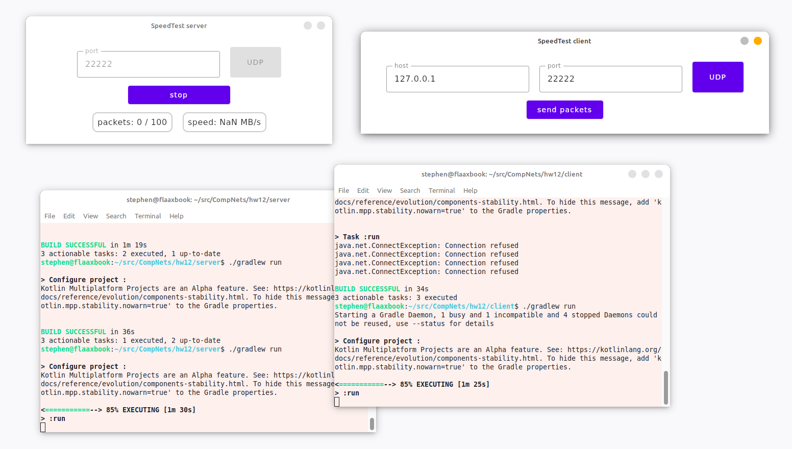
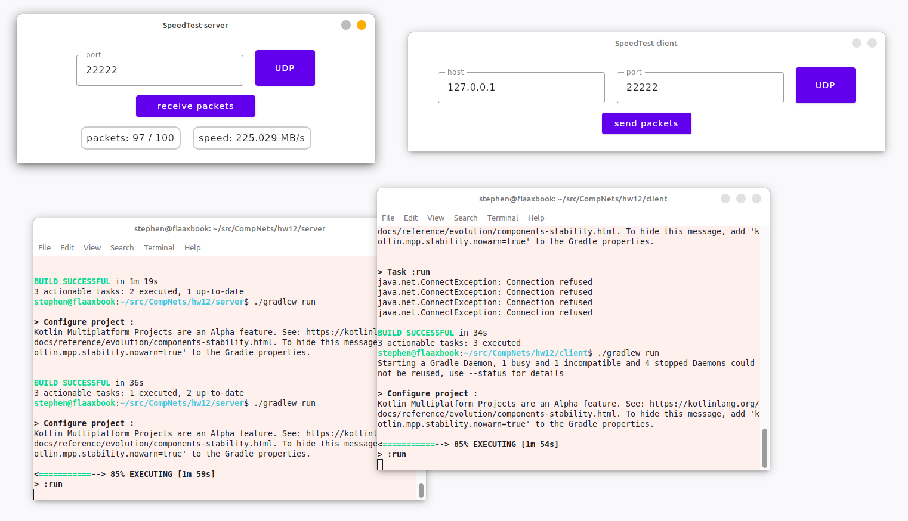
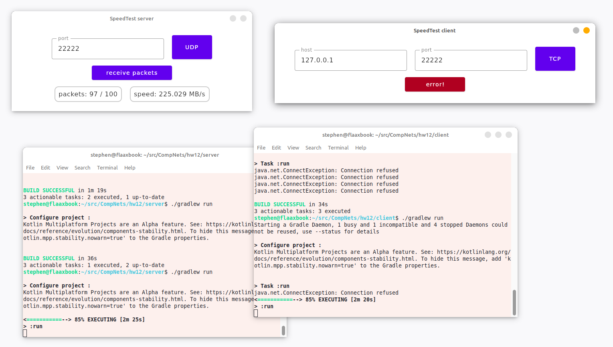

# Лабораторная работа #12
*Степан Остапенко, гр 20.Б09-мкн*

## 2. Скорость передачи

Приложение написано на kotlin с использованием Compose Desktop.

Ссылки: [клиент](./client), [сервер](./server).

Запуск: `./gradlew run` из корня соответствующей папки.

### Примеры работы

#### Скорость соединения по TCP

#### Ожидание UDP-пакетов

#### Скорость соединения по UDP

#### Ошибка соединения

