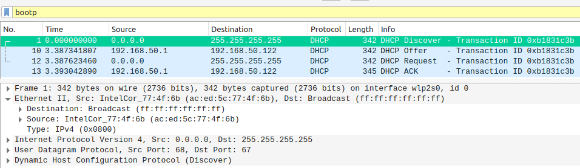
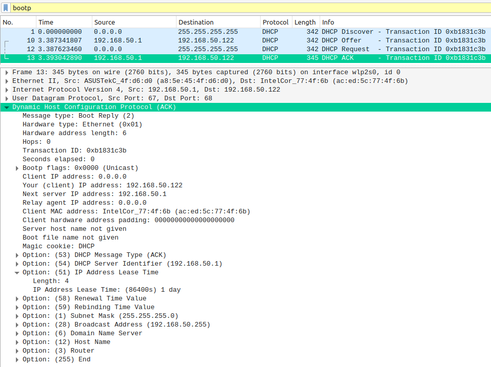

# Лабораторная работа #13
*Степан Остапенко, гр 20.Б09-мкн*

## 1. Wireshark: DHCP

#### 1

Легко видеть, что в каждом запросе содержится UDP-пакет.

#### 2

Адрес `ac:ed:5c:77:4f:6b`, это MAC-адрес моего компьютера.

#### 3

Видно, что `Transaction ID` у всех пакетов равен `0xb1831c3b`. Это поле используется моим хостом для идентификации того, к какому DHCP-запросу относится присланный ответ, т. к. все DHCP запросы отправляются по широковещательной рассылке.

#### 4

Мой хост использует адрес `0.0.0.0` и отправляет дейтаграммы по адресу `255.255.255.255` (широковещательная рассылка).

DHCP-сервер использует свой адрес `192.168.50.1` и отправляет дейтаграммы по предполагаемому адресу моего компьютера `192.168.50.122` (м. б. это происходит из-за того, что у меня статический IP-адрес).

#### 5

`192.168.50.1`

#### 6

IP-адрес выделяется на ограниченное количество времени, после чего для дальнейшего использования его нужно продлять.

В моем случае это время &ndash; 86400 секунд или 1 день.

## 3. Задачи

Решения задач находятся в файле [`theor.pdf`](./assets/theor.pdf).
