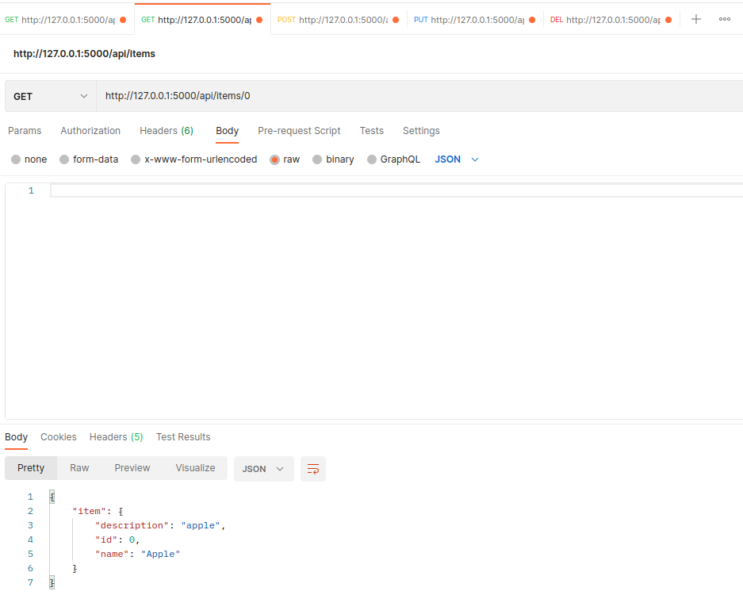
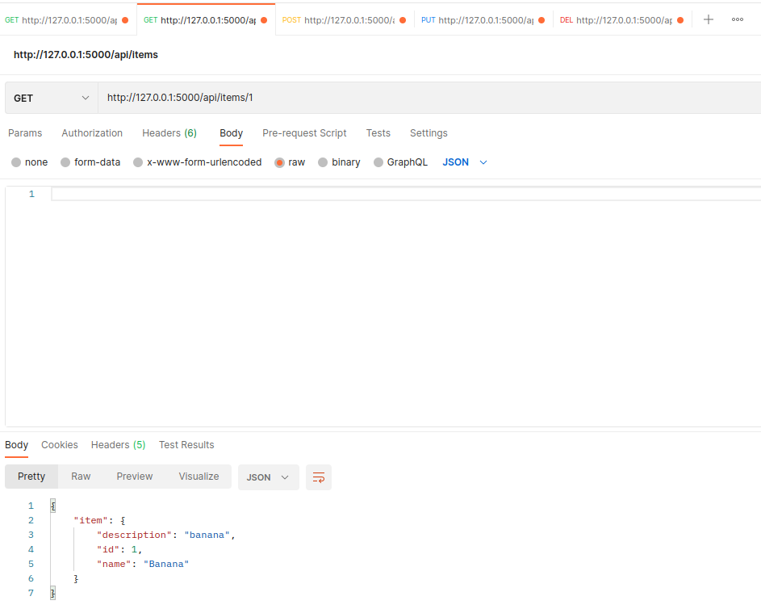
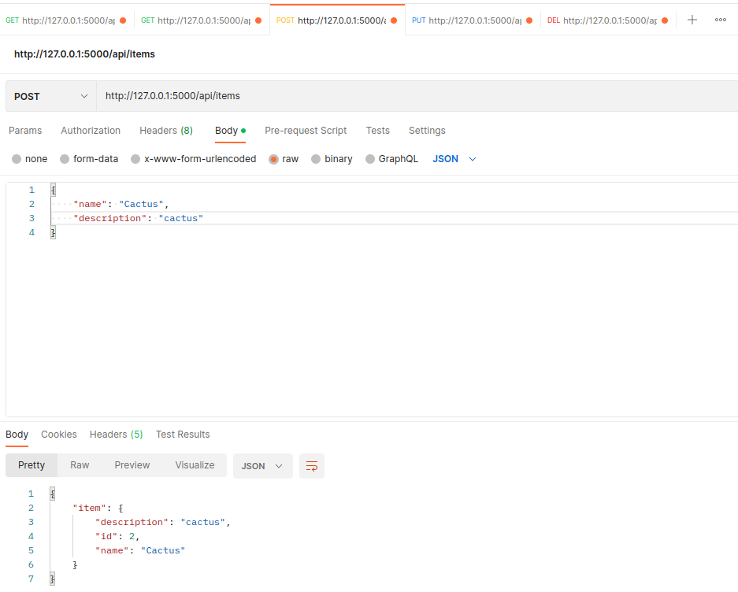
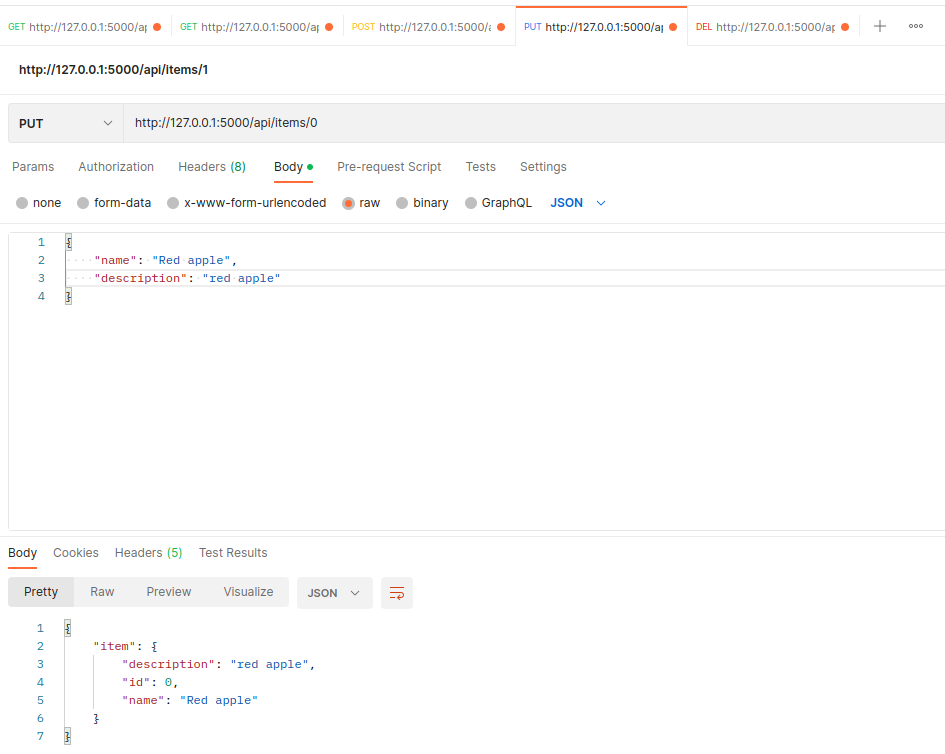
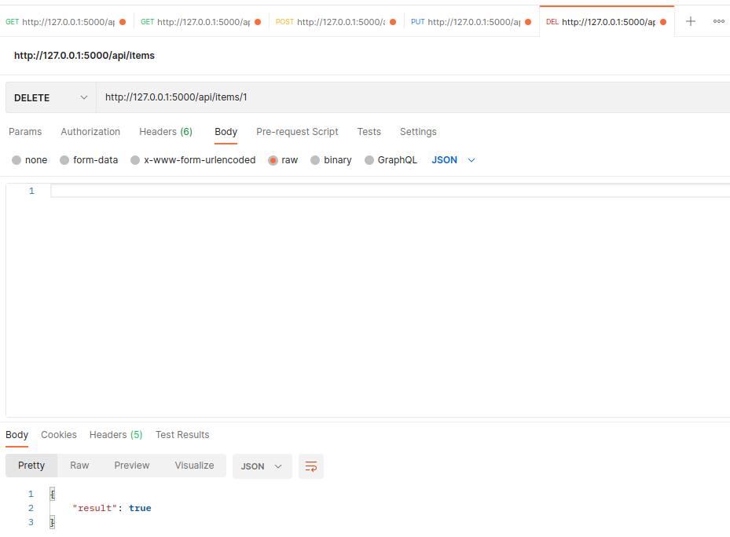
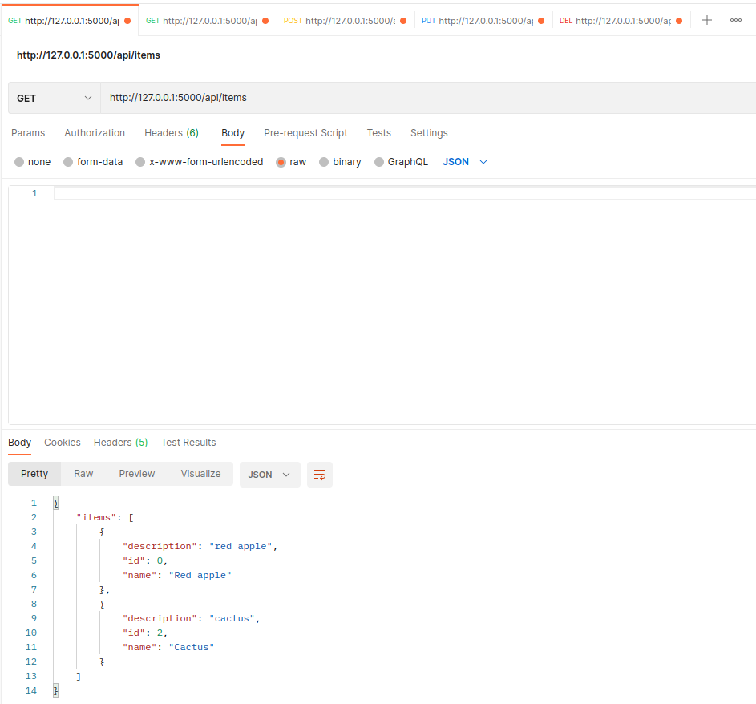
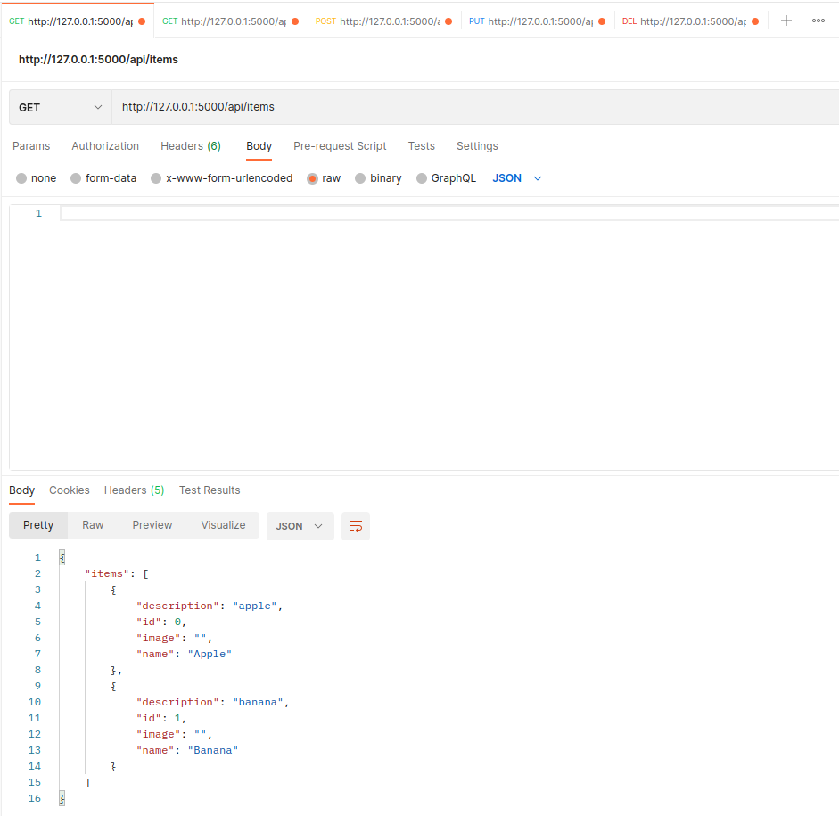
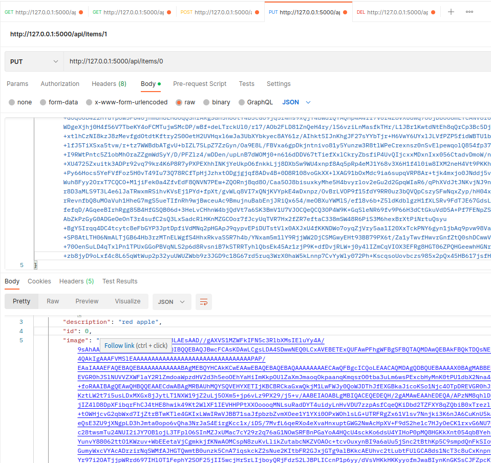
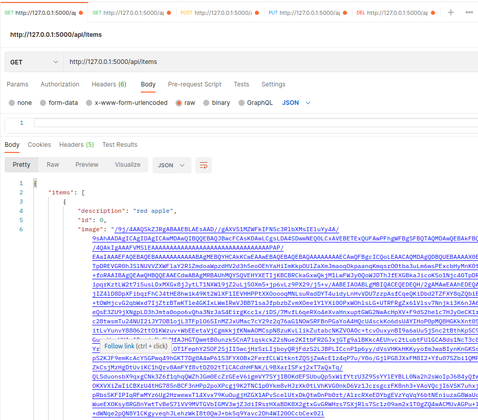

# Лабораторная работа #2
*Степан Остапенко, гр 20.Б09-мкн*

## Задание 1

### Часть A

В файле `service.py` есть реализация REST сервиса на фреймворке flask для языка python.

Для запуска сервиса нужно просто запустить `service.py` как обычный файл на python.

### Часть B

Примеры запросов к сервису с помощью Postman:

#### Запрос всех объектов (GET)

#### Запрос отдельного объекта по `id` (GET)

#### Добавление объекта (POST)

#### Обновление объекта (PUT)

#### Удаление объекта (DELETE)

#### Запрос всех объектов после проделанных операций

### Часть C

Поскольку в этой лабораторной мы не используем клиент, здесь сложно реализовать удобное добавление картинки. Я придумал добавить к каждому объекту поле `image`, в которое можно записать любую информацию о картинке, например, ссылку на нее или сырые данные в формате Base64. Впоследствии эту информацию можно использовать для отображения картинки на странице.

Сервис с поддержкой картинок находится в файле `service-with-images.py` и запускается ровно так же, как и упрощенный сервис.

Далее представлены примеры работы с картинками в формате Base64.

#### Запрос всех объектов (GET)

#### Добавление объекта (POST)

#### Обновление объекта (PUT)

#### Запрос всех объектов после проделанных операций

## Задание 2

Решения теоретических задач находятся в файле [theory.pdf](./theory.pdf).
