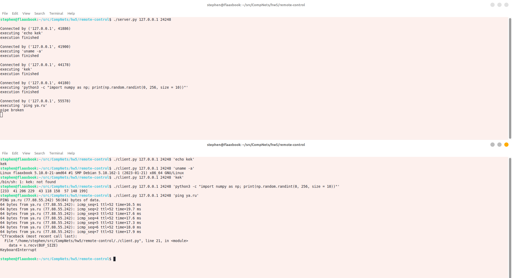

# Лабораторная работа #5
*Степан Остапенко, гр 20.Б09-мкн*

## Задание 1

### 2. Удаленный запуск команд

Клиент и сервер для удаленного запуска команд, реализованные на python, находятся в папке [`remote-control`](./remote-control).

#### Сервер

Запуск:
```shell
./server.py <host> <port>
```

#### Клиент

Запуск:
```shell
./client.py <host> <port> <command with args>
```

#### Пример работы


