# Лабораторная работа #6
*Степан Остапенко, гр 20.Б09-мкн*

## Задание 1

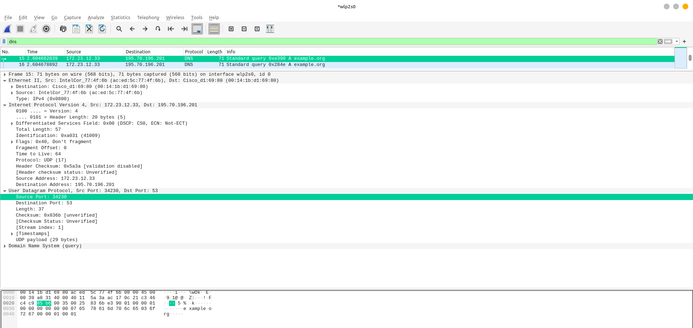

1. В поле `User Datagram Protocol` видно 4 поля: `Source Port`, `Destination Port`, `Length` и `Checksum`.
2. В панели снизу отображается байтовое представление пакета, а также то, где какое поле находится в пакете. Если ткнуть на одно из полей, в панели снизу высветятся два байта (как на картинке). Из этого можно сделать вывод, что каждое поле занимает ровно два байта.
3. Длина всего пакета. Это можно проверить: в нашем случае длина равна 37, а внизу написано, что тело пакета занимает 29 байт, и, при этом, у нас есть четыре заголовка по два байта каждый.
4. Под длину пакета отводится два байта, поэтому длина может быть не более 65535. Минус 8 байт на заголовок. Получается 65527.
5. Аналогично, т. к. под порты в заголовке отводится по два байта, максимальное возможное значение порта &ndash; 65535.
6. Номер в десятичной системе равен 17. Его можно узнать из поля `Protocol: UDP (17)`. Номер в шестнадцатеричной системе можно узнать из байтового представления пакета в панели внизу (в указанном поле записано `11`).
7. В wireshark для каждого пакета можно узнать его пару (ответ для запроса и наоборот). Таким образом можно увидеть, что порты отправителя и получателя просто меняются местами.

## Задание 2

### 1. FileZilla сервер и клиент

#### Подключение к серверу от лица администратора

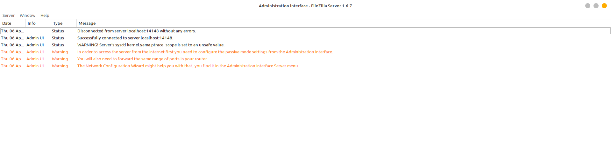

#### Создание тестового пользователя

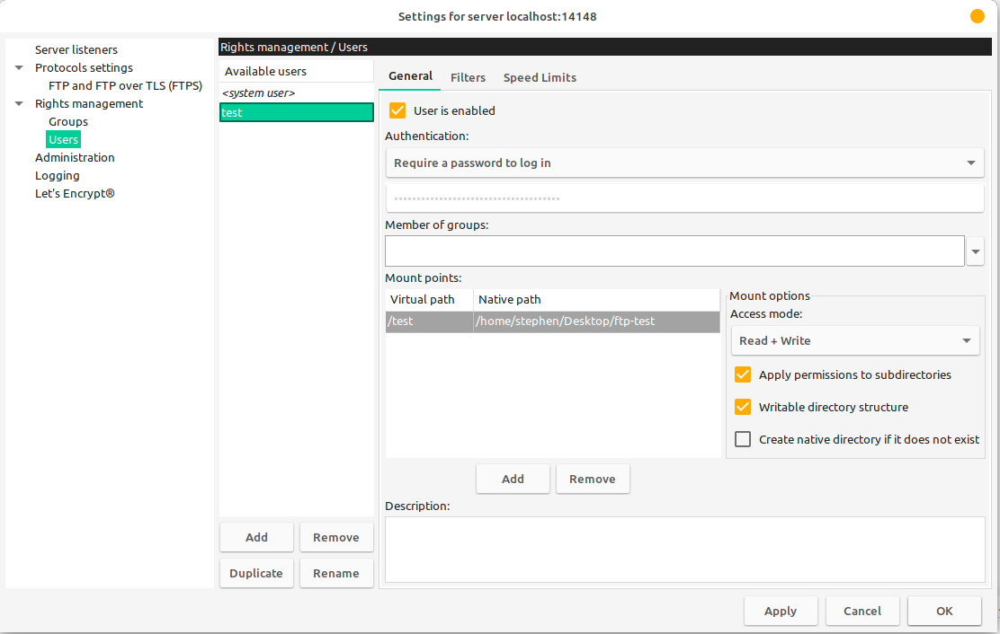

#### Клиент Filezilla

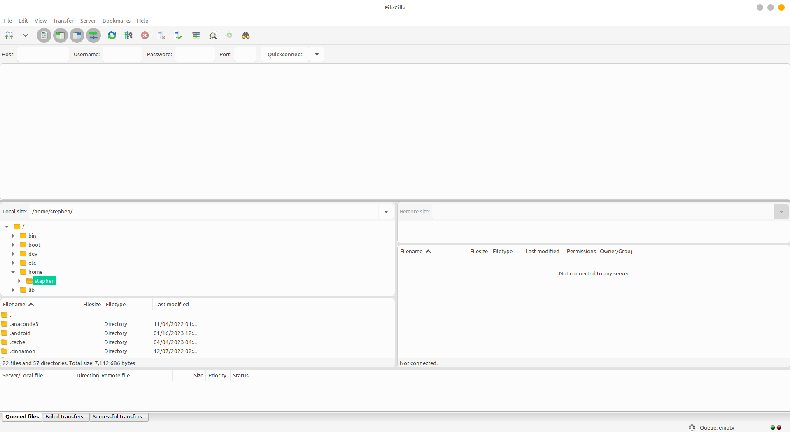

#### Вход в учетную запись тестового пользователя

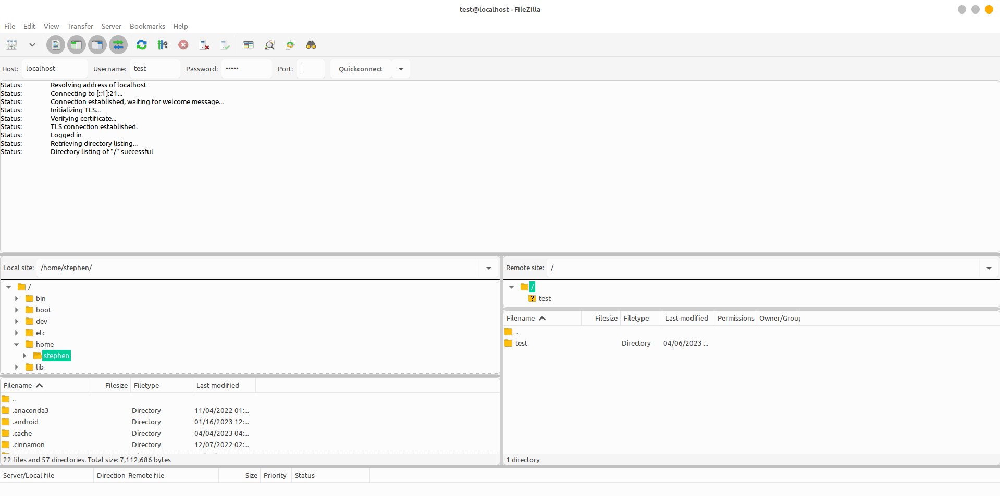

#### Просмотр списка файлов

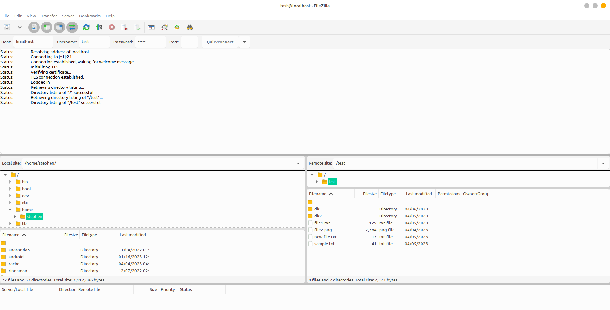

#### Создание папки

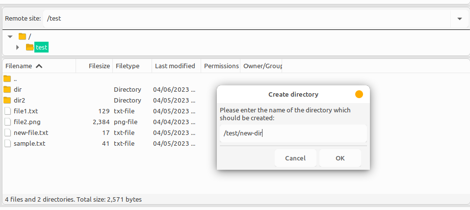

#### Загрузка файла на сервер

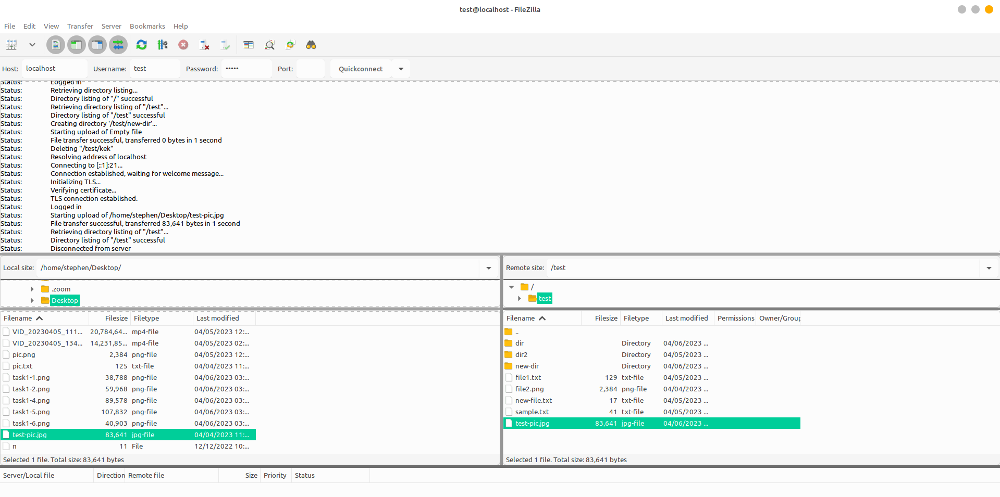

#### Скачивание файла с сервера

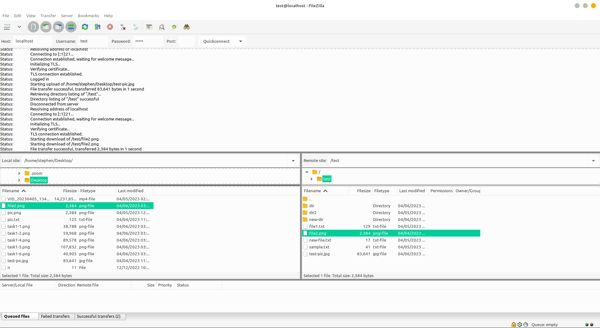

#### Панель администратора после всех операций

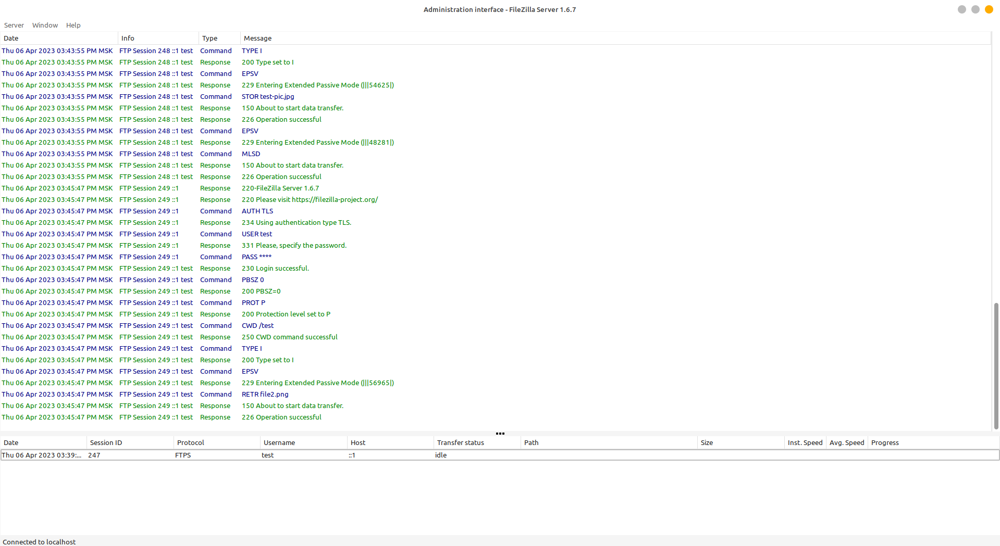

### 2. FTP клиент

Интерфейс FTP клиента находится в папке [`FtpClientCore`](./ftp-client/FtpClientCore). Консольная реализация находится в папке [`ConsoleClient`](./ftp-client/ConsoleClient).

Запуск с помощью gradle:

* получить список папок и файлов
```shell
./gradlew ConsoleClient:run --args="list -h <host> [-P <port>] -u <username> -p <password> -f <path to file or folder on server>"
```

* вывести содержимое файла в консоль
```shell
./gradlew ConsoleClient:run --args="read -h <host> [-P <port>] -u <username> -p <password> -f <path to file>"
```

* скачать файл с сервера
```shell
./gradlew ConsoleClient:run --args="download -h <host> [-P <port>] -u <username> -p <password> -f <path to file on server>:<path to file on local machine>"
```

* загрузить файл на сервер
```shell
./gradlew ConsoleClient:run --args="upload -h <host> [-P <port>] -u <username> -p <password> -f <path to file on server>:<path to file on local machine>"
```

### 3. GUI FTP клиент

Клиент с графическим интерфейсом находится в папке [`ftp-client`](./ftp-client) (код в файле [`Main.kt`](./ftp-client/src/jvmMain/kotlin/Main.kt)).

Запуск с помощью gradle:
```shell
./gradlew :run
```

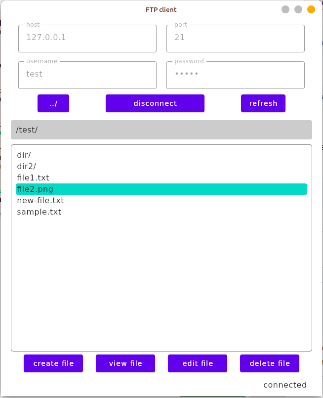
