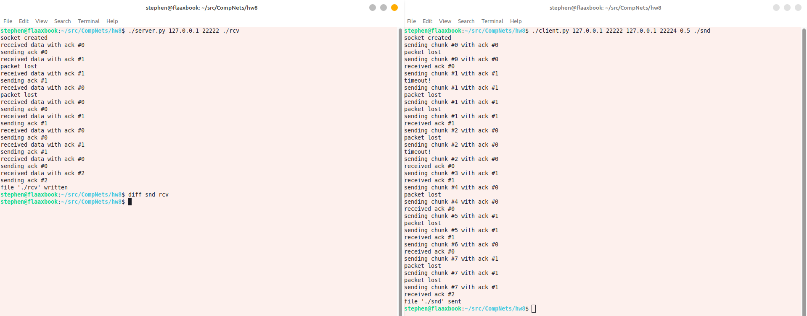

# Лабораторная работа #8
*Степан Остапенко, гр 20.Б09-мкн*

## 1. Реализация протокола Stop and Wait

### А. Общие требования

Сервер и клиент реализованы в файлах [`server.py`](./server.py) и [`client.py`](./client.py) соответственно.

Запуск:
```shell
./server.py <host> <port> <path to file for saving data>
```

```shell
./client.py <server host> <server port> <client host> <client port> <timeout in seconds> <path to file for sending>
```

Пример запуска:


### В. Контрольные суммы

В процессе передачи для каждого сообщения вычисляется контрольная сумма (реализация в следующем задании). Если контрольная сумма не проходит проверку, сообщение игнорируется.

## 2. Контрольные суммы

Вычисление контрольных сумм реализовано в файле [`checksums.py`](./checksums.py). Тесты реализованы в файле [`test_checksums.py`](./test_checksums.py).

Запуск тестов:
```shell
./test_checksums.py
```
