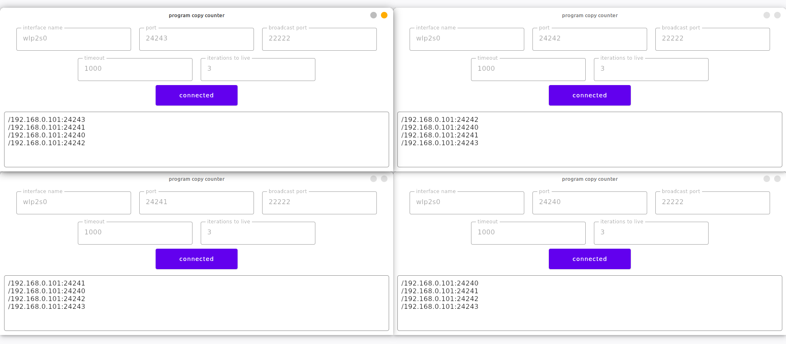
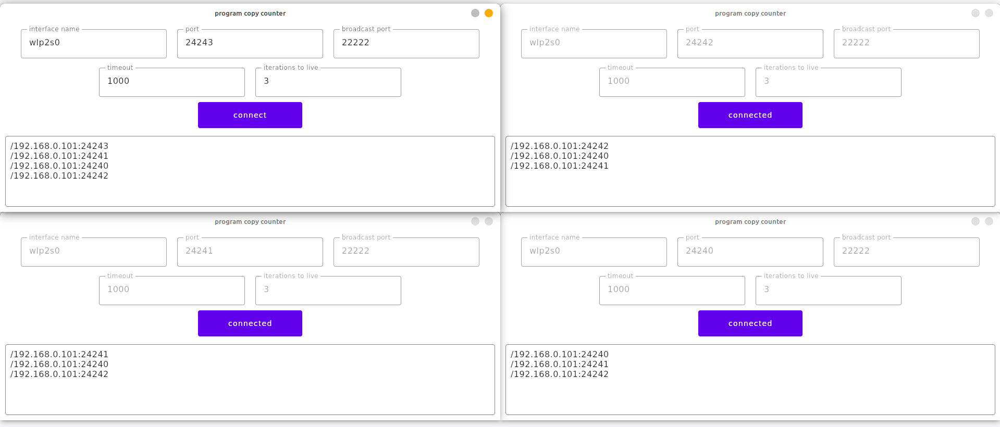
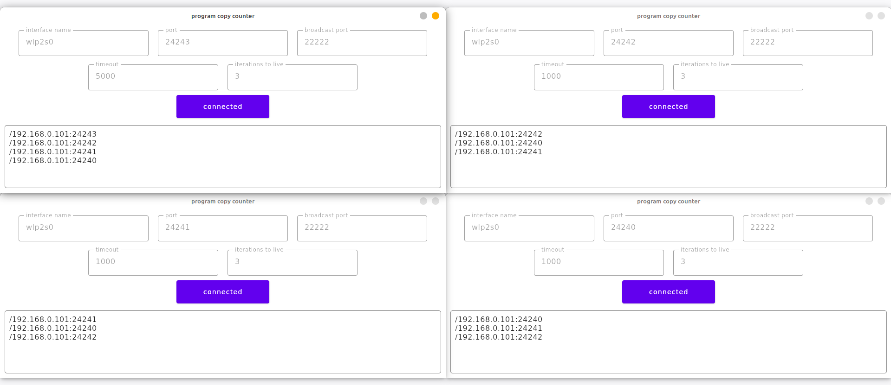
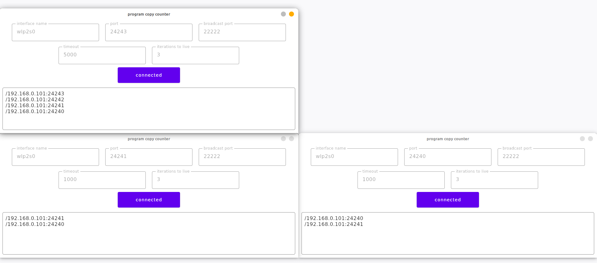

# Лабораторная работа #9
*Степан Остапенко, гр 20.Б09-мкн*

## 3. Широковещательная рассылка для подсчета копий приложения

Задание реализовано на kotlin с использованием Compose Desktop. Реализация находится в папке [`counter`](./counter).

Запуск производится через `./gradlew run`.

Поля:
1. `interface name`&ndash; имя сетевого интерфейса, который используется для доступа к локальной сети
(например: `lo`, `lo0`, `wlp2s0`, `en0`, `eth0`, ...);
2. `port`&ndash; порт для работающего приложения;
3. `broadcast port`&ndash; порт, использующийся для рассылки (никакие работающие приложения не должны его занимать);
4. `timeout`&ndash; таймаут, с которым приложение ожидает сообщения от других приложений и делает рассылку о своем состоянии;
5. `iterations to live`&ndash; сколько подряд сообщений от другого приложения должно быть пропущено, чтобы оно больше не считалось работающим.

### Примеры работы

#### Все приложения в сборе

#### Одно отключилось

#### Одно приложение не видно из-за слишком большого таймаута

*У верхнего левого приложения слишком большой таймаут, поэтому остальные не считают его живым.*

#### Одно приложение аварийно завершилось

*Верхнее правое приложение аварийно завершилось и не успело послать всем остальным соответствующий сигнал. Два нижних заметили его
отсутствие. У верхнего левого приложения слишком большой таймаут, поэтому оно еще не успело заметить отсутствие верхнего правого.*
